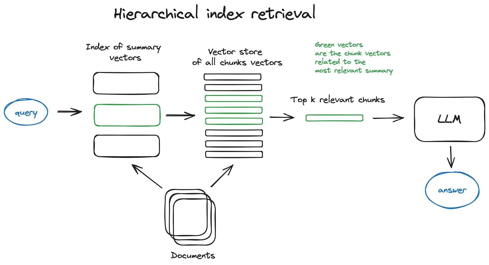

  
   
   ## {{ tag[0] }}  
     
   
    <h1>设计文章标题</h1>  
    
这是一篇关于设计的文章。设计是一种将想法转化为现实的过程，它涉及到各种领域，包括平面设计、工业设计、室内设计等。
  
   - *{{ post.date | date_to_string }}* [{{ post.title }}]({{ post.url | relative_url }})  
     
   
 
