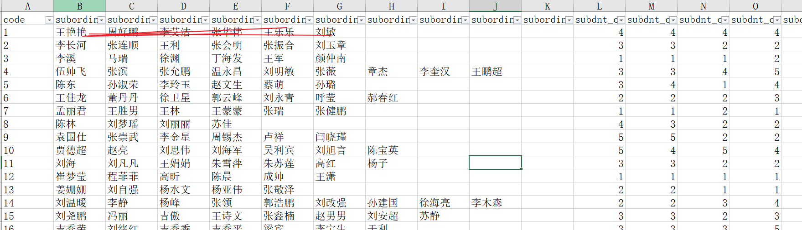
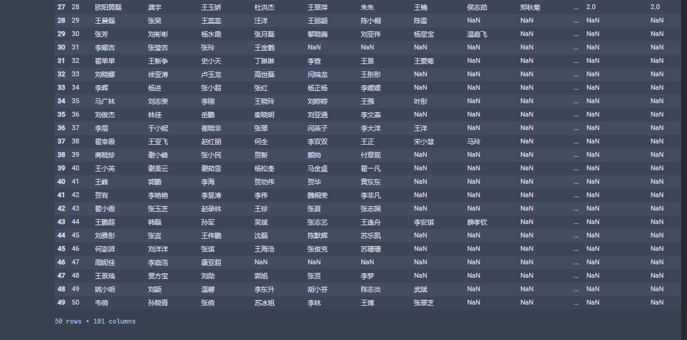
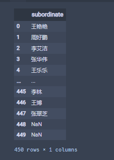
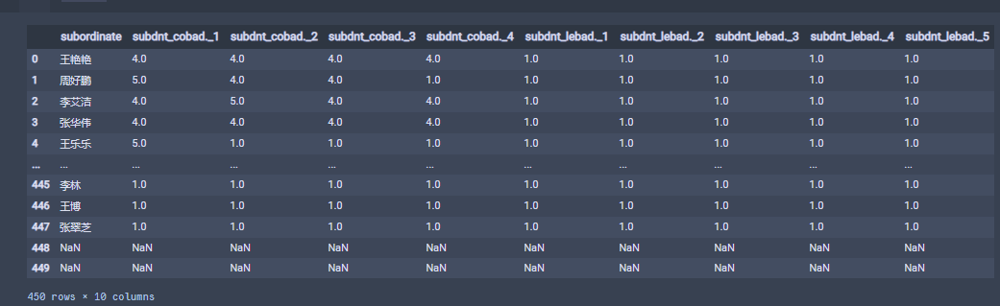

pandas快速处理excel表格1

# Question
- 近期接到一个excel处理
- 基本任务就是复制粘贴
- 
- 把横向数据部分转到后向
# Solution
**首先分析数据**

数据共3类整合

每类10组，仔细观察第十组全是空白数据所以等效为9组

**其次导入数据**

打开jupyter

导入excel


```
import pandas as pd
import numpy as np
df1=pd.read_excel('leader3.xlsx')
df1
```

得到了50 rows × 101 columns

**分割数据**

分成三类
```
df2=df1.iloc[:,1:10]
df2
```


剩下以此类推

**矩阵转数组扁平化**

```
ar=np.array(df2).flatten()
ar
```


**数组矩阵化**
```
df3=pd.DataFrame(arr,columns=["subordinate"])
df3
```


**合并**

```
result = pd.concat([df3, df5, df7], axis=1)
result
```


**缺失值处理**
```
result1=result.dropna(axis=0,how='all')
result1
```


**导出**
```
result1.to_excel('leader3副本完成.xlsx',index=False)
```

## 下面附完整代码
```
import pandas as pd
import numpy as np
df1=pd.read_excel('leader3.xlsx')
df2=df1.iloc[:,1:10]
ar=np.array(df2).flatten()
df3=pd.DataFrame(arr,columns=["subordinate"])
df4=df1.iloc[:,11:47]
ar1=np.array(df4).flatten()
df5=pd.DataFrame(ar1.reshape(450,4),columns=["subdnt_cobad._1","subdnt_cobad._2","subdnt_cobad._3","subdnt_cobad._4"])
df6=df1.iloc[:,51:96]
ar2=np.array(df6).flatten()
df7=pd.DataFrame(ar2.reshape(450,5),columns=["subdnt_lebad._1","subdnt_lebad._2","subdnt_lebad._3","subdnt_lebad._4","subdnt_lebad._5"])
result = pd.concat([df3, df5, df7], axis=1).dropna(axis=0,how='all')
result.to_excel('leader3副本完成.xlsx',index=False)
```