```python
#导入相关包
import warnings 
warnings.filterwarnings('ignore')
import numpy as np
import pandas as pd
import seaborn as sns
#设置sns样式
sns.set(style='white',context='notebook',palette='muted')
import matplotlib.pyplot as plt
#导入数据
train=pd.read_csv('train.csv')
test=pd.read_csv('test.csv')
```


```python
#理解数据
print('实验数据大小:',train.shape)
print('预测数据大小:',test.shape)
```

    实验数据大小: (891, 12)
    预测数据大小: (418, 11)
    


```python
#记录异常值缺失值情况
full=train.append(test,ignore_index=True)
full.describe()
```


<div>
<style scoped>
    .dataframe tbody tr th:only-of-type {
        vertical-align: middle;
    }

    .dataframe tbody tr th {
        vertical-align: top;
    }

    .dataframe thead th {
        text-align: right;
    }
</style>
<table border="1" class="dataframe">
  <thead>
    <tr style="text-align: right;">
      <th></th>
      <th>PassengerId</th>
      <th>Survived</th>
      <th>Pclass</th>
      <th>Age</th>
      <th>SibSp</th>
      <th>Parch</th>
      <th>Fare</th>
    </tr>
  </thead>
  <tbody>
    <tr>
      <th>count</th>
      <td>1309.000000</td>
      <td>891.000000</td>
      <td>1309.000000</td>
      <td>1046.000000</td>
      <td>1309.000000</td>
      <td>1309.000000</td>
      <td>1308.000000</td>
    </tr>
    <tr>
      <th>mean</th>
      <td>655.000000</td>
      <td>0.383838</td>
      <td>2.294882</td>
      <td>29.881138</td>
      <td>0.498854</td>
      <td>0.385027</td>
      <td>33.295479</td>
    </tr>
    <tr>
      <th>std</th>
      <td>378.020061</td>
      <td>0.486592</td>
      <td>0.837836</td>
      <td>14.413493</td>
      <td>1.041658</td>
      <td>0.865560</td>
      <td>51.758668</td>
    </tr>
    <tr>
      <th>min</th>
      <td>1.000000</td>
      <td>0.000000</td>
      <td>1.000000</td>
      <td>0.170000</td>
      <td>0.000000</td>
      <td>0.000000</td>
      <td>0.000000</td>
    </tr>
    <tr>
      <th>25%</th>
      <td>328.000000</td>
      <td>0.000000</td>
      <td>2.000000</td>
      <td>21.000000</td>
      <td>0.000000</td>
      <td>0.000000</td>
      <td>7.895800</td>
    </tr>
    <tr>
      <th>50%</th>
      <td>655.000000</td>
      <td>0.000000</td>
      <td>3.000000</td>
      <td>28.000000</td>
      <td>0.000000</td>
      <td>0.000000</td>
      <td>14.454200</td>
    </tr>
    <tr>
      <th>75%</th>
      <td>982.000000</td>
      <td>1.000000</td>
      <td>3.000000</td>
      <td>39.000000</td>
      <td>1.000000</td>
      <td>0.000000</td>
      <td>31.275000</td>
    </tr>
    <tr>
      <th>max</th>
      <td>1309.000000</td>
      <td>1.000000</td>
      <td>3.000000</td>
      <td>80.000000</td>
      <td>8.000000</td>
      <td>9.000000</td>
      <td>512.329200</td>
    </tr>
  </tbody>
</table>
</div>


```python
full.info()
```

    <class 'pandas.core.frame.DataFrame'>
    RangeIndex: 1309 entries, 0 to 1308
    Data columns (total 12 columns):
     #   Column       Non-Null Count  Dtype  
    ---  ------       --------------  -----  
     0   PassengerId  1309 non-null   int64  
     1   Survived     891 non-null    float64
     2   Pclass       1309 non-null   int64  
     3   Name         1309 non-null   object 
     4   Sex          1309 non-null   object 
     5   Age          1046 non-null   float64
     6   SibSp        1309 non-null   int64  
     7   Parch        1309 non-null   int64  
     8   Ticket       1309 non-null   object 
     9   Fare         1308 non-null   float64
     10  Cabin        295 non-null    object 
     11  Embarked     1307 non-null   object 
    dtypes: float64(3), int64(4), object(5)
    memory usage: 122.8+ KB
    


```python
# Age Fare Cabin Embarked 均有缺失
```

# 查看特征与标签间的关系

### 3.2.1 Embarked与Survived：法国登船的乘客生存率较


```python
sns.barplot(data=train,x='Embarked',y='Survived')
```


    <matplotlib.axes._subplots.AxesSubplot at 0x194d2300250>


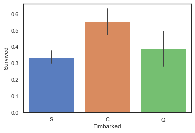


```python
#计算不同类型embarked的乘客，其生存率为多少
print('Embarked为"S"的乘客，其生存率为%.2f'%full['Survived'][full['Embarked']=='S'].value_counts(normalize=True)[1])
print('Embarked为"C"的乘客，其生存率为%.2f'%full['Survived'][full['Embarked']=='C'].value_counts(normalize=True)[1])
print('Embarked为"Q"的乘客，其生存率为%.2f'%full['Survived'][full['Embarked']=='Q'].value_counts(normalize=True)[1])
#'C','Q'代码类同'S'，这里不赘述啦
```

    Embarked为"S"的乘客，其生存率为0.34
    Embarked为"C"的乘客，其生存率为0.55
    Embarked为"Q"的乘客，其生存率为0.39
    


```python
# 法国登船乘客生存率较高原因可能与其头等舱乘客比例较高有关，因此继续查看不同登船地点乘客各舱位乘客数量情况。
sns.factorplot('Pclass',col='Embarked',data=train,kind='count',size=3)
```


    <seaborn.axisgrid.FacetGrid at 0x194d239b190>


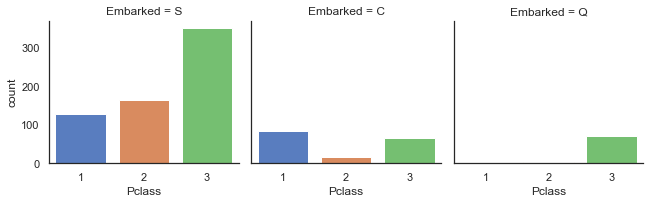


### 3.2.2 Parch与Survived：当乘客同行的父母及子女数量适中时，生存率较高


```python
sns.barplot(data=train,x='Parch',y='Survived')
```


    <matplotlib.axes._subplots.AxesSubplot at 0x194d24b6bb0>


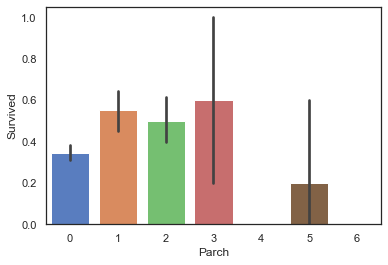


### 3.2.3 SibSp与Survived：当乘客同行的同辈数量适中时生存率较高


```python
sns.barplot(data=train,x='SibSp',y='Survived')
```


    <matplotlib.axes._subplots.AxesSubplot at 0x194d24e6c10>


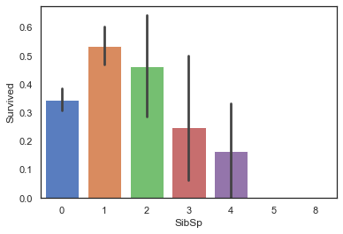


### 3.2.4 Pclass与Survived：乘客客舱等级越高，生存率越高


```python
sns.barplot(data=train,x='Pclass',y='Survived')
```


    <matplotlib.axes._subplots.AxesSubplot at 0x194d259bdc0>


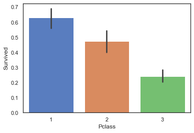


### 3.2.5 Sex与Survived：女性的生存率远高于男性


```python
sns.barplot(data=train,x='Sex',y='Survived')
```


    <matplotlib.axes._subplots.AxesSubplot at 0x194d260d100>


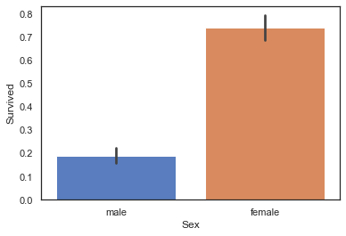


### 3.2.6 Age与Survived：当乘客年龄段在0-10岁期间时生存率会较高


```python
#创建坐标轴
ageFacet=sns.FacetGrid(train,hue='Survived',aspect=3)
#作图，选择图形类型
ageFacet.map(sns.kdeplot,'Age',shade=True)
#其他信息：坐标轴范围、标签等
ageFacet.set(xlim=(0,train['Age'].max()))
ageFacet.add_legend()
```


    <seaborn.axisgrid.FacetGrid at 0x194d26558b0>


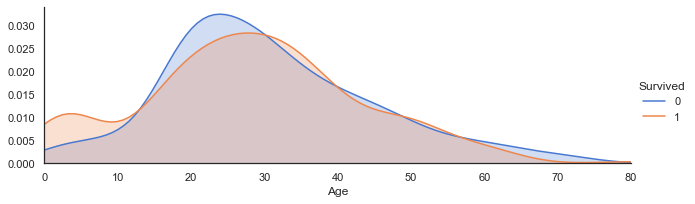


### 3.2.7 Fare与Survived：当票价低于18左右时乘客生存率较低，票价越高生存率一般越高


```python
ageFacet=sns.FacetGrid(train,hue='Survived',aspect=3)
ageFacet.map(sns.kdeplot,'Fare',shade=True)
ageFacet.set(xlim=(0,150))
ageFacet.add_legend()
```


    <seaborn.axisgrid.FacetGrid at 0x194d26cb610>


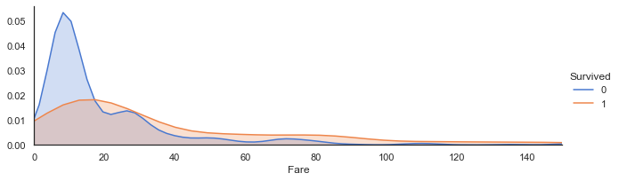


### 查看票价的分布特征


```python
farePlot=sns.distplot(full['Fare'][full['Fare'].notnull()],label='skewness:%.2f'%(full['Fare'].skew()))
farePlot.legend(loc='best')
```


    <matplotlib.legend.Legend at 0x194d2720730>


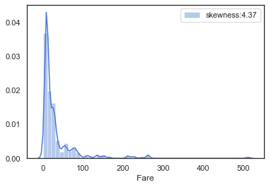


### fare的分布呈左偏的形态，其偏度skewness=4.37较大，说明数据偏移平均值较多，因此我们需要对数据进行对数化处理，防止数据权重分布不均匀。


```python
#对数化处理fare值
full['Fare']=full['Fare'].map(lambda x: np.log(x) if x>0 else 0)
```

# 4.数据预处理

### 4.1.1Cabin缺失值填充


```python
full['Cabin']=full['Cabin'].fillna('U')
full['Cabin'].head()
```


    0       U
    1     C85
    2       U
    3    C123
    4       U
    Name: Cabin, dtype: object


### 4.1.2Embarked缺失值填充


```python
#对Embarked缺失值进行处理，查看缺失值情况
full[full['Embarked'].isnull()]
```


<div>
<style scoped>
    .dataframe tbody tr th:only-of-type {
        vertical-align: middle;
    }

    .dataframe tbody tr th {
        vertical-align: top;
    }

    .dataframe thead th {
        text-align: right;
    }
</style>
<table border="1" class="dataframe">
  <thead>
    <tr style="text-align: right;">
      <th></th>
      <th>PassengerId</th>
      <th>Survived</th>
      <th>Pclass</th>
      <th>Name</th>
      <th>Sex</th>
      <th>Age</th>
      <th>SibSp</th>
      <th>Parch</th>
      <th>Ticket</th>
      <th>Fare</th>
      <th>Cabin</th>
      <th>Embarked</th>
    </tr>
  </thead>
  <tbody>
    <tr>
      <th>61</th>
      <td>62</td>
      <td>1.0</td>
      <td>1</td>
      <td>Icard, Miss. Amelie</td>
      <td>female</td>
      <td>38.0</td>
      <td>0</td>
      <td>0</td>
      <td>113572</td>
      <td>4.382027</td>
      <td>B28</td>
      <td>NaN</td>
    </tr>
    <tr>
      <th>829</th>
      <td>830</td>
      <td>1.0</td>
      <td>1</td>
      <td>Stone, Mrs. George Nelson (Martha Evelyn)</td>
      <td>female</td>
      <td>62.0</td>
      <td>0</td>
      <td>0</td>
      <td>113572</td>
      <td>4.382027</td>
      <td>B28</td>
      <td>NaN</td>
    </tr>
  </tbody>
</table>
</div>


```python
full['Embarked'].value_counts()
full['Embarked']=full['Embarked'].fillna('S')
```

### 4.1.3Fare缺失值填充


```python
full[full['Fare'].isnull()]
```


<div>
<style scoped>
    .dataframe tbody tr th:only-of-type {
        vertical-align: middle;
    }

    .dataframe tbody tr th {
        vertical-align: top;
    }

    .dataframe thead th {
        text-align: right;
    }
</style>
<table border="1" class="dataframe">
  <thead>
    <tr style="text-align: right;">
      <th></th>
      <th>PassengerId</th>
      <th>Survived</th>
      <th>Pclass</th>
      <th>Name</th>
      <th>Sex</th>
      <th>Age</th>
      <th>SibSp</th>
      <th>Parch</th>
      <th>Ticket</th>
      <th>Fare</th>
      <th>Cabin</th>
      <th>Embarked</th>
    </tr>
  </thead>
  <tbody>
  </tbody>
</table>
</div>


```python
full['Fare']=full['Fare'].fillna(full[(full['Pclass']==3)&(full['Embarked']=='S')&(full['Cabin']=='U')]['Fare'].mean())
```

## 4.2特征工程

### 4.2.1 Name中的头衔信息-Title


```python
full['Title']=full['Name'].map(lambda x:x.split(',')[1].split('.')[0].strip())
#查看title数据分布
full['Title'].value_counts()
```


    Mr              757
    Miss            260
    Mrs             197
    Master           61
    Rev               8
    Dr                8
    Col               4
    Mlle              2
    Major             2
    Ms                2
    the Countess      1
    Dona              1
    Jonkheer          1
    Lady              1
    Capt              1
    Don               1
    Sir               1
    Mme               1
    Name: Title, dtype: int64


```python
TitleDict={}
TitleDict['Mr']='Mr'
TitleDict['Mlle']='Miss'
TitleDict['Miss']='Miss'
TitleDict['Master']='Master'
TitleDict['Jonkheer']='Master'
TitleDict['Mme']='Mrs'
TitleDict['Ms']='Mrs'
TitleDict['Mrs']='Mrs'
TitleDict['Don']='Royalty'
TitleDict['Sir']='Royalty'
TitleDict['the Countess']='Royalty'
TitleDict['Dona']='Royalty'
TitleDict['Lady']='Royalty'
TitleDict['Capt']='Officer'
TitleDict['Col']='Officer'
TitleDict['Major']='Officer'
TitleDict['Dr']='Officer'
TitleDict['Rev']='Officer'

full['Title']=full['Title'].map(TitleDict)
full['Title'].value_counts()
```


    Mr         757
    Miss       262
    Mrs        200
    Master      62
    Officer     23
    Royalty      5
    Name: Title, dtype: int64


```python
sns.barplot(data=full,x='Title',y='Survived')
```


    <matplotlib.axes._subplots.AxesSubplot at 0x194d2400d60>


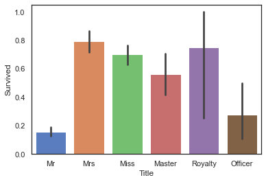


### 4.2.2 FamilyNum及FamilySize信息


```python
full['familyNum']=full['Parch']+full['SibSp']+1
#查看familyNum与Survived
sns.barplot(data=full,x='familyNum',y='Survived')
```


    <matplotlib.axes._subplots.AxesSubplot at 0x194d27af580>


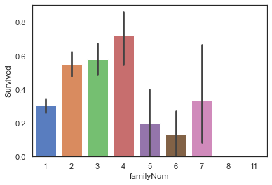


```python
def familysize(familyNum):
    if familyNum==1:
        return 0
    elif (familyNum>=2)&(familyNum<=4):
        return 1
    else:
        return 2

full['familySize']=full['familyNum'].map(familysize)
full['familySize'].value_counts()
```


    0    790
    1    437
    2     82
    Name: familySize, dtype: int64


```python
sns.barplot(data=full,x='familySize',y='Survived')
```


    <matplotlib.axes._subplots.AxesSubplot at 0x194d28d4be0>


# 4.2.3 Cabin客舱类型信息-Deck


```python
full['Deck']=full['Cabin'].map(lambda x:x[0])
#查看不同Deck类型乘客的生存率
sns.barplot(data=full,x='Deck',y='Survived')
```


    <matplotlib.axes._subplots.AxesSubplot at 0x194d2929610>


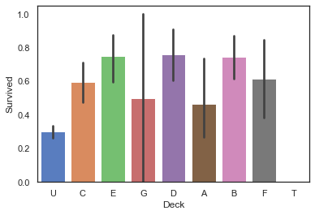


### 4.2.4 共票号乘客数量TickCot及TickGroup


```python
TickCountDict={}
TickCountDict=full['Ticket'].value_counts()
TickCountDict.head()
```


    CA. 2343        11
    1601             8
    CA 2144          8
    3101295          7
    S.O.C. 14879     7
    Name: Ticket, dtype: int64


```python
#将同票号乘客数量数据并入数据集中
full['TickCot']=full['Ticket'].map(TickCountDict)
full['TickCot'].head()
```


    0    1
    1    2
    2    1
    3    2
    4    1
    Name: TickCot, dtype: int64


```python
#查看TickCot与Survived之间关系
sns.barplot(data=full,x='TickCot',y='Survived')
```


    <matplotlib.axes._subplots.AxesSubplot at 0x194d2998c70>


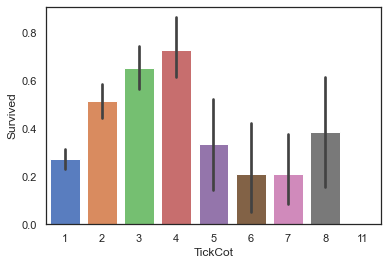


```python
#按照TickCot大小，将TickGroup分为三类。
def TickCountGroup(num):
    if (num>=2)&(num<=4):
        return 0
    elif (num==1)|((num>=5)&(num<=8)):
        return 1
    else :
        return 2
#得到各位乘客TickGroup的类别
full['TickGroup']=full['TickCot'].map(TickCountGroup)
#查看TickGroup与Survived之间关系
sns.barplot(data=full,x='TickGroup',y='Survived')
```


    <matplotlib.axes._subplots.AxesSubplot at 0x194d2a16520>


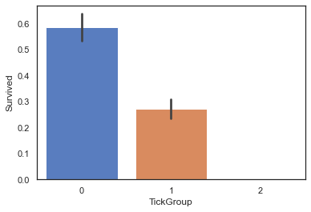


### 4.2.5Age缺失值填充-构建随机森林模型预测缺失的数据


```python
full[full['Age'].isnull()].head()
```


<div>
<style scoped>
    .dataframe tbody tr th:only-of-type {
        vertical-align: middle;
    }

    .dataframe tbody tr th {
        vertical-align: top;
    }

    .dataframe thead th {
        text-align: right;
    }
</style>
<table border="1" class="dataframe">
  <thead>
    <tr style="text-align: right;">
      <th></th>
      <th>PassengerId</th>
      <th>Survived</th>
      <th>Pclass</th>
      <th>Name</th>
      <th>Sex</th>
      <th>Age</th>
      <th>SibSp</th>
      <th>Parch</th>
      <th>Ticket</th>
      <th>Fare</th>
      <th>Cabin</th>
      <th>Embarked</th>
      <th>Title</th>
      <th>familyNum</th>
      <th>familySize</th>
      <th>Deck</th>
      <th>TickCot</th>
      <th>TickGroup</th>
    </tr>
  </thead>
  <tbody>
    <tr>
      <th>5</th>
      <td>6</td>
      <td>0.0</td>
      <td>3</td>
      <td>Moran, Mr. James</td>
      <td>male</td>
      <td>NaN</td>
      <td>0</td>
      <td>0</td>
      <td>330877</td>
      <td>2.135148</td>
      <td>U</td>
      <td>Q</td>
      <td>Mr</td>
      <td>1</td>
      <td>0</td>
      <td>U</td>
      <td>1</td>
      <td>1</td>
    </tr>
    <tr>
      <th>17</th>
      <td>18</td>
      <td>1.0</td>
      <td>2</td>
      <td>Williams, Mr. Charles Eugene</td>
      <td>male</td>
      <td>NaN</td>
      <td>0</td>
      <td>0</td>
      <td>244373</td>
      <td>2.564949</td>
      <td>U</td>
      <td>S</td>
      <td>Mr</td>
      <td>1</td>
      <td>0</td>
      <td>U</td>
      <td>1</td>
      <td>1</td>
    </tr>
    <tr>
      <th>19</th>
      <td>20</td>
      <td>1.0</td>
      <td>3</td>
      <td>Masselmani, Mrs. Fatima</td>
      <td>female</td>
      <td>NaN</td>
      <td>0</td>
      <td>0</td>
      <td>2649</td>
      <td>1.977547</td>
      <td>U</td>
      <td>C</td>
      <td>Mrs</td>
      <td>1</td>
      <td>0</td>
      <td>U</td>
      <td>1</td>
      <td>1</td>
    </tr>
    <tr>
      <th>26</th>
      <td>27</td>
      <td>0.0</td>
      <td>3</td>
      <td>Emir, Mr. Farred Chehab</td>
      <td>male</td>
      <td>NaN</td>
      <td>0</td>
      <td>0</td>
      <td>2631</td>
      <td>1.977547</td>
      <td>U</td>
      <td>C</td>
      <td>Mr</td>
      <td>1</td>
      <td>0</td>
      <td>U</td>
      <td>1</td>
      <td>1</td>
    </tr>
    <tr>
      <th>28</th>
      <td>29</td>
      <td>1.0</td>
      <td>3</td>
      <td>O'Dwyer, Miss. Ellen "Nellie"</td>
      <td>female</td>
      <td>NaN</td>
      <td>0</td>
      <td>0</td>
      <td>330959</td>
      <td>2.064226</td>
      <td>U</td>
      <td>Q</td>
      <td>Miss</td>
      <td>1</td>
      <td>0</td>
      <td>U</td>
      <td>1</td>
      <td>1</td>
    </tr>
  </tbody>
</table>
</div>


```python
AgePre=full[['Age','Parch','Pclass','SibSp','Title','familyNum','TickCot']]
#进行one-hot编码
AgePre=pd.get_dummies(AgePre)
ParAge=pd.get_dummies(AgePre['Parch'],prefix='Parch')
SibAge=pd.get_dummies(AgePre['SibSp'],prefix='SibSp')
PclAge=pd.get_dummies(AgePre['Pclass'],prefix='Pclass')
#查看变量间相关性
AgeCorrDf=pd.DataFrame()
AgeCorrDf=AgePre.corr()
AgeCorrDf['Age'].sort_values()

#拼接数据
AgePre=pd.concat([AgePre,ParAge,SibAge,PclAge],axis=1)
AgePre.head()
```


<div>
<style scoped>
    .dataframe tbody tr th:only-of-type {
        vertical-align: middle;
    }

    .dataframe tbody tr th {
        vertical-align: top;
    }

    .dataframe thead th {
        text-align: right;
    }
</style>
<table border="1" class="dataframe">
  <thead>
    <tr style="text-align: right;">
      <th></th>
      <th>Age</th>
      <th>Parch</th>
      <th>Pclass</th>
      <th>SibSp</th>
      <th>familyNum</th>
      <th>TickCot</th>
      <th>Title_Master</th>
      <th>Title_Miss</th>
      <th>Title_Mr</th>
      <th>Title_Mrs</th>
      <th>...</th>
      <th>SibSp_0</th>
      <th>SibSp_1</th>
      <th>SibSp_2</th>
      <th>SibSp_3</th>
      <th>SibSp_4</th>
      <th>SibSp_5</th>
      <th>SibSp_8</th>
      <th>Pclass_1</th>
      <th>Pclass_2</th>
      <th>Pclass_3</th>
    </tr>
  </thead>
  <tbody>
    <tr>
      <th>0</th>
      <td>22.0</td>
      <td>0</td>
      <td>3</td>
      <td>1</td>
      <td>2</td>
      <td>1</td>
      <td>0</td>
      <td>0</td>
      <td>1</td>
      <td>0</td>
      <td>...</td>
      <td>0</td>
      <td>1</td>
      <td>0</td>
      <td>0</td>
      <td>0</td>
      <td>0</td>
      <td>0</td>
      <td>0</td>
      <td>0</td>
      <td>1</td>
    </tr>
    <tr>
      <th>1</th>
      <td>38.0</td>
      <td>0</td>
      <td>1</td>
      <td>1</td>
      <td>2</td>
      <td>2</td>
      <td>0</td>
      <td>0</td>
      <td>0</td>
      <td>1</td>
      <td>...</td>
      <td>0</td>
      <td>1</td>
      <td>0</td>
      <td>0</td>
      <td>0</td>
      <td>0</td>
      <td>0</td>
      <td>1</td>
      <td>0</td>
      <td>0</td>
    </tr>
    <tr>
      <th>2</th>
      <td>26.0</td>
      <td>0</td>
      <td>3</td>
      <td>0</td>
      <td>1</td>
      <td>1</td>
      <td>0</td>
      <td>1</td>
      <td>0</td>
      <td>0</td>
      <td>...</td>
      <td>1</td>
      <td>0</td>
      <td>0</td>
      <td>0</td>
      <td>0</td>
      <td>0</td>
      <td>0</td>
      <td>0</td>
      <td>0</td>
      <td>1</td>
    </tr>
    <tr>
      <th>3</th>
      <td>35.0</td>
      <td>0</td>
      <td>1</td>
      <td>1</td>
      <td>2</td>
      <td>2</td>
      <td>0</td>
      <td>0</td>
      <td>0</td>
      <td>1</td>
      <td>...</td>
      <td>0</td>
      <td>1</td>
      <td>0</td>
      <td>0</td>
      <td>0</td>
      <td>0</td>
      <td>0</td>
      <td>1</td>
      <td>0</td>
      <td>0</td>
    </tr>
    <tr>
      <th>4</th>
      <td>35.0</td>
      <td>0</td>
      <td>3</td>
      <td>0</td>
      <td>1</td>
      <td>1</td>
      <td>0</td>
      <td>0</td>
      <td>1</td>
      <td>0</td>
      <td>...</td>
      <td>1</td>
      <td>0</td>
      <td>0</td>
      <td>0</td>
      <td>0</td>
      <td>0</td>
      <td>0</td>
      <td>0</td>
      <td>0</td>
      <td>1</td>
    </tr>
  </tbody>
</table>
<p>5 rows × 30 columns</p>
</div>


```python
#拆分实验集和预测集
AgeKnown=AgePre[AgePre['Age'].notnull()]
AgeUnKnown=AgePre[AgePre['Age'].isnull()]

#生成实验数据的特征和标签
AgeKnown_X=AgeKnown.drop(['Age'],axis=1)
AgeKnown_y=AgeKnown['Age']
#生成预测数据的特征
AgeUnKnown_X=AgeUnKnown.drop(['Age'],axis=1)

#利用随机森林构建模型
from sklearn.ensemble import RandomForestRegressor
rfr=RandomForestRegressor(random_state=None,n_estimators=500,n_jobs=-1)
rfr.fit(AgeKnown_X,AgeKnown_y)
```


    RandomForestRegressor(n_estimators=500, n_jobs=-1)


### 3、利用模型进行预测并填入原数据集中


```python
rfr.score(AgeKnown_X,AgeKnown_y)
```


    0.5875085143761927


```python
#预测年龄
AgeUnKnown_y=rfr.predict(AgeUnKnown_X)
#填充预测数据
full.loc[full['Age'].isnull(),['Age']]=AgeUnKnown_y
full.info()  #此时已无缺失值
```

    <class 'pandas.core.frame.DataFrame'>
    RangeIndex: 1309 entries, 0 to 1308
    Data columns (total 18 columns):
     #   Column       Non-Null Count  Dtype  
    ---  ------       --------------  -----  
     0   PassengerId  1309 non-null   int64  
     1   Survived     891 non-null    float64
     2   Pclass       1309 non-null   int64  
     3   Name         1309 non-null   object 
     4   Sex          1309 non-null   object 
     5   Age          1309 non-null   float64
     6   SibSp        1309 non-null   int64  
     7   Parch        1309 non-null   int64  
     8   Ticket       1309 non-null   object 
     9   Fare         1309 non-null   float64
     10  Cabin        1309 non-null   object 
     11  Embarked     1309 non-null   object 
     12  Title        1309 non-null   object 
     13  familyNum    1309 non-null   int64  
     14  familySize   1309 non-null   int64  
     15  Deck         1309 non-null   object 
     16  TickCot      1309 non-null   int64  
     17  TickGroup    1309 non-null   int64  
    dtypes: float64(3), int64(8), object(7)
    memory usage: 184.2+ KB
    

### 4.3同组识别


```python
#提取乘客的姓氏及相应的乘客数
full['Surname']=full['Name'].map(lambda x:x.split(',')[0].strip())
SurNameDict={}
SurNameDict=full['Surname'].value_counts()
full['SurnameNum']=full['Surname'].map(SurNameDict)

#将数据分为两组
MaleDf=full[(full['Sex']=='male')&(full['Age']>12)&(full['familyNum']>=2)]
FemChildDf=full[((full['Sex']=='female')|(full['Age']<=12))&(full['familyNum']>=2)]
```


```python
#分析男性同组效应
MSurNamDf=MaleDf['Survived'].groupby(MaleDf['Surname']).mean()
MSurNamDf.head()
MSurNamDf.value_counts()
```


    0.0    89
    1.0    19
    0.5     3
    Name: Survived, dtype: int64


```python
MSurNamDict={}
MSurNamDict=MSurNamDf[MSurNamDf.values==1].index
MSurNamDict
```


    Index(['Beane', 'Beckwith', 'Bishop', 'Cardeza', 'Chambers', 'Dick',
           'Duff Gordon', 'Frauenthal', 'Frolicher-Stehli', 'Goldenberg',
           'Greenfield', 'Harder', 'Hoyt', 'Kimball', 'Lindqvist', 'McCoy',
           'Nakid', 'Persson', 'Taylor'],
          dtype='object', name='Surname')


```python
FCSurNamDf=FemChildDf['Survived'].groupby(FemChildDf['Surname']).mean()
FCSurNamDf.head()
FCSurNamDf.value_counts()
```


    1.000000    115
    0.000000     27
    0.750000      2
    0.333333      1
    0.142857      1
    Name: Survived, dtype: int64


```python
FCSurNamDict={}
FCSurNamDict=FCSurNamDf[FCSurNamDf.values==0].index
FCSurNamDict
```


    Index(['Ahlin', 'Arnold-Franchi', 'Barbara', 'Boulos', 'Bourke', 'Caram',
           'Danbom', 'Ford', 'Goodwin', 'Ilmakangas', 'Johnston', 'Jussila',
           'Lahtinen', 'Lefebre', 'Lobb', 'Palsson', 'Panula', 'Rice', 'Robins',
           'Rosblom', 'Sage', 'Skoog', 'Strom', 'Turpin', 'Van Impe',
           'Vander Planke', 'Zabour'],
          dtype='object', name='Surname')


```python
full.loc[(full['Survived'].isnull())&(full['Surname'].isin(MSurNamDict))&(full['Sex']=='male'),'Age']=5
full.loc[(full['Survived'].isnull())&(full['Surname'].isin(MSurNamDict))&(full['Sex']=='male'),'Sex']='female'

#对数据集中这些姓氏的女性及儿童的数据进行修正：1、性别改为男；2、年龄改为60。
full.loc[(full['Survived'].isnull())&(full['Surname'].isin(FCSurNamDict))&((full['Sex']=='female')|(full['Age']<=12)),'Age']=60
full.loc[(full['Survived'].isnull())&(full['Surname'].isin(FCSurNamDict))&((full['Sex']=='female')|(full['Age']<=12)),'Sex']='male'
```

# 4.4筛选子集


```python
#人工筛选
fullSel=full.drop(['Cabin','Name','Ticket','PassengerId','Surname','SurnameNum'],axis=1)
#查看各特征与标签的相关性
corrDf=pd.DataFrame()
corrDf=fullSel.corr()
corrDf['Survived'].sort_values(ascending=True)
```


    Pclass       -0.338481
    TickGroup    -0.319278
    Age          -0.059792
    SibSp        -0.035322
    familyNum     0.016639
    TickCot       0.064962
    Parch         0.081629
    familySize    0.108631
    Fare          0.331805
    Survived      1.000000
    Name: Survived, dtype: float64


```python
#热力图，查看Survived与其他特征间相关性大小
plt.figure(figsize=(8,8))
sns.heatmap(fullSel[['Survived','Age','Embarked','Fare','Parch','Pclass',
                    'Sex','SibSp','Title','familyNum','familySize','Deck',
                     'TickCot','TickGroup']].corr(),cmap='BrBG',annot=True,
           linewidths=.5)
plt.xticks(rotation=45)
```


    (array([0.5, 1.5, 2.5, 3.5, 4.5, 5.5, 6.5, 7.5, 8.5, 9.5]),
     <a list of 10 Text major ticklabel objects>)


```python
fullSel=fullSel.drop(['familyNum','SibSp','TickCot','Parch'],axis=1)
#one-hot编码
fullSel=pd.get_dummies(fullSel)
PclassDf=pd.get_dummies(full['Pclass'],prefix='Pclass')
TickGroupDf=pd.get_dummies(full['TickGroup'],prefix='TickGroup')
familySizeDf=pd.get_dummies(full['familySize'],prefix='familySize')

fullSel=pd.concat([fullSel,PclassDf,TickGroupDf,familySizeDf],axis=1)
```

# 5.构建模型

#### 本文先比较了SCV/Decision Tree/Gradient Boosting/Neural network/KNN/Logistic Regression等多种机器学习算法的结果，并对表现较好的Gradient Boosting及Logistic Regression做进一步的对比，最终选择Gradient Boosting对乘客生存率进行预测。

##  5.1模型选择

# 主要考虑使用以下常用的机器学习算法进行比较：

- SCV
- Decision Tree
- Extra Trees
- Gradient Boosting
- Random Forest
- KNN
- Logistic Regression
- Linear Discriminant Analysis


```python
#拆分实验数据与预测数据
experData=fullSel[fullSel['Survived'].notnull()]
preData=fullSel[fullSel['Survived'].isnull()]

experData_X=experData.drop('Survived',axis=1)
experData_y=experData['Survived']
preData_X=preData.drop('Survived',axis=1)

#导入机器学习算法库
from sklearn.ensemble import RandomForestClassifier,GradientBoostingClassifier,ExtraTreesClassifier
from sklearn.discriminant_analysis import LinearDiscriminantAnalysis
from sklearn.linear_model import LogisticRegression
from sklearn.neighbors import KNeighborsClassifier
from sklearn.tree import DecisionTreeClassifier
from sklearn.svm import SVC
from sklearn.model_selection import GridSearchCV,cross_val_score,StratifiedKFold

#设置kfold，交叉采样法拆分数据集
kfold=StratifiedKFold(n_splits=10)

#汇总不同模型算法
classifiers=[]
classifiers.append(SVC())
classifiers.append(DecisionTreeClassifier())
classifiers.append(RandomForestClassifier())
classifiers.append(ExtraTreesClassifier())
classifiers.append(GradientBoostingClassifier())
classifiers.append(KNeighborsClassifier())
classifiers.append(LogisticRegression())
classifiers.append(LinearDiscriminantAnalysis())
```

### 5.1.2比较各种算法结果，进一步选择模型


```python
#不同机器学习交叉验证结果汇总
cv_results=[]
for classifier in classifiers:
    cv_results.append(cross_val_score(classifier,experData_X,experData_y,
                                      scoring='accuracy',cv=kfold,n_jobs=-1))
```


```python
#求出模型得分的均值和标准差
cv_means=[]
cv_std=[]
for cv_result in cv_results:
    cv_means.append(cv_result.mean())
    cv_std.append(cv_result.std())
    
#汇总数据
cvResDf=pd.DataFrame({'cv_mean':cv_means,
                     'cv_std':cv_std,
                     'algorithm':['SVC','DecisionTreeCla','RandomForestCla','ExtraTreesCla',
                                  'GradientBoostingCla','KNN','LR','LinearDiscrimiAna']})

cvResDf
```


<div>
<style scoped>
    .dataframe tbody tr th:only-of-type {
        vertical-align: middle;
    }

    .dataframe tbody tr th {
        vertical-align: top;
    }

    .dataframe thead th {
        text-align: right;
    }
</style>
<table border="1" class="dataframe">
  <thead>
    <tr style="text-align: right;">
      <th></th>
      <th>cv_mean</th>
      <th>cv_std</th>
      <th>algorithm</th>
    </tr>
  </thead>
  <tbody>
    <tr>
      <th>0</th>
      <td>0.764419</td>
      <td>0.050512</td>
      <td>SVC</td>
    </tr>
    <tr>
      <th>1</th>
      <td>0.778976</td>
      <td>0.058657</td>
      <td>DecisionTreeCla</td>
    </tr>
    <tr>
      <th>2</th>
      <td>0.815980</td>
      <td>0.043057</td>
      <td>RandomForestCla</td>
    </tr>
    <tr>
      <th>3</th>
      <td>0.799139</td>
      <td>0.045985</td>
      <td>ExtraTreesCla</td>
    </tr>
    <tr>
      <th>4</th>
      <td>0.837291</td>
      <td>0.041373</td>
      <td>GradientBoostingCla</td>
    </tr>
    <tr>
      <th>5</th>
      <td>0.794657</td>
      <td>0.038325</td>
      <td>KNN</td>
    </tr>
    <tr>
      <th>6</th>
      <td>0.827191</td>
      <td>0.031660</td>
      <td>LR</td>
    </tr>
    <tr>
      <th>7</th>
      <td>0.823833</td>
      <td>0.029460</td>
      <td>LinearDiscrimiAna</td>
    </tr>
  </tbody>
</table>
</div>


```python
# sns.barplot(data=cvResDf,x='cv_mean',y='algorithm',**{'xerr':cv_std})

cvResFacet=sns.FacetGrid(cvResDf.sort_values(by='cv_mean',ascending=False),sharex=False,
            sharey=False,aspect=2)
cvResFacet.map(sns.barplot,'cv_mean','algorithm',**{'xerr':cv_std},
               palette='muted')
cvResFacet.set(xlim=(0.7,0.9))
cvResFacet.add_legend()
```


    <seaborn.axisgrid.FacetGrid at 0x194d5419880>


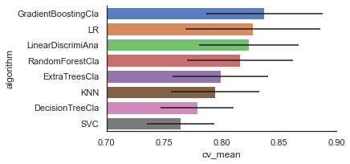


# 5.1.3模型调优

综合以上模型表现，考虑选择GradientBoostingCla、LR两种模型进一步对比。

分别建立GradientBoostingClassifier以及LogisticRegression模型，并进行模型调优。


```python
#GradientBoostingClassifier模型
GBC = GradientBoostingClassifier()
gb_param_grid = {'loss' : ["deviance"],
              'n_estimators' : [100,200,300],
              'learning_rate': [0.1, 0.05, 0.01],
              'max_depth': [4, 8],
              'min_samples_leaf': [100,150],
              'max_features': [0.3, 0.1] 
              }
modelgsGBC = GridSearchCV(GBC,param_grid = gb_param_grid, cv=kfold, 
                                     scoring="accuracy", n_jobs= -1, verbose = 1)
modelgsGBC.fit(experData_X,experData_y)

#LogisticRegression模型
modelLR=LogisticRegression()
LR_param_grid = {'C' : [1,2,3],
                'penalty':['l1','l2']}
modelgsLR = GridSearchCV(modelLR,param_grid = LR_param_grid, cv=kfold, 
                                     scoring="accuracy", n_jobs= -1, verbose = 1)
modelgsLR.fit(experData_X,experData_y)
```

    Fitting 10 folds for each of 72 candidates, totalling 720 fits
    

    [Parallel(n_jobs=-1)]: Using backend LokyBackend with 8 concurrent workers.
    [Parallel(n_jobs=-1)]: Done  52 tasks      | elapsed:    2.1s
    [Parallel(n_jobs=-1)]: Done 272 tasks      | elapsed:   13.3s
    [Parallel(n_jobs=-1)]: Done 522 tasks      | elapsed:   27.9s
    [Parallel(n_jobs=-1)]: Done 720 out of 720 | elapsed:   38.1s finished
    

    Fitting 10 folds for each of 6 candidates, totalling 60 fits
    

    [Parallel(n_jobs=-1)]: Using backend LokyBackend with 8 concurrent workers.
    [Parallel(n_jobs=-1)]: Done  60 out of  60 | elapsed:    0.6s finished
    


    GridSearchCV(cv=StratifiedKFold(n_splits=10, random_state=None, shuffle=False),
                 estimator=LogisticRegression(), n_jobs=-1,
                 param_grid={'C': [1, 2, 3], 'penalty': ['l1', 'l2']},
                 scoring='accuracy', verbose=1)


5.2 查看模型得分

1、查看模型准确度


```python
#modelgsGBC模型
print('modelgsGBC模型得分为：%.3f'%modelgsGBC.best_score_)
#modelgsLR模型
print('modelgsLR模型得分为：%.3f'%modelgsLR.best_score_)
```

    modelgsGBC模型得分为：0.842
    modelgsLR模型得分为：0.828
    


```python
#查看模型ROC曲线
#求出测试数据模型的预测值
modelgsGBCtestpre_y=modelgsGBC.predict(experData_X).astype(int)
#画图
from sklearn.metrics import roc_curve, auc  ###计算roc和auc
# Compute ROC curve and ROC area for each class
fpr,tpr,threshold = roc_curve(experData_y, modelgsGBCtestpre_y) ###计算真正率和假正率
roc_auc = auc(fpr,tpr) ###计算auc的值

plt.figure()
lw = 2
plt.figure(figsize=(10,10))
plt.plot(fpr, tpr, color='r',
         lw=lw, label='ROC curve (area = %0.3f)' % roc_auc) ###假正率为横坐标，真正率为纵坐标做曲线
plt.plot([0, 1], [0, 1], color='navy', lw=lw, linestyle='--')
plt.xlim([0.0, 1.0])
plt.ylim([0.0, 1.0])
plt.xlabel('False Positive Rate')
plt.ylabel('True Positive Rate')
plt.title('Titanic GradientBoostingClassifier Model')
plt.legend(loc="lower right")
plt.show()
```


    <Figure size 432x288 with 0 Axes>


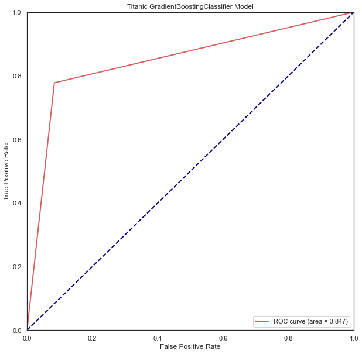


```python
#查看模型ROC曲线
#求出测试数据模型的预测值
testpre_y=modelgsLR.predict(experData_X).astype(int)
#画图
from sklearn.metrics import roc_curve, auc  ###计算roc和auc
# Compute ROC curve and ROC area for each class
fpr,tpr,threshold = roc_curve(experData_y, testpre_y) ###计算真正率和假正率
roc_auc = auc(fpr,tpr) ###计算auc的值

plt.figure()
lw = 2
plt.figure(figsize=(10,10))
plt.plot(fpr, tpr, color='r',
         lw=lw, label='ROC curve (area = %0.3f)' % roc_auc) ###假正率为横坐标，真正率为纵坐标做曲线
plt.plot([0, 1], [0, 1], color='navy', lw=lw, linestyle='--')
plt.xlim([0.0, 1.0])
plt.ylim([0.0, 1.0])
plt.xlabel('False Positive Rate')
plt.ylabel('True Positive Rate')
plt.title('Titanic LogisticRegression Model')
plt.legend(loc="lower right")
plt.show()
```


    <Figure size 432x288 with 0 Axes>


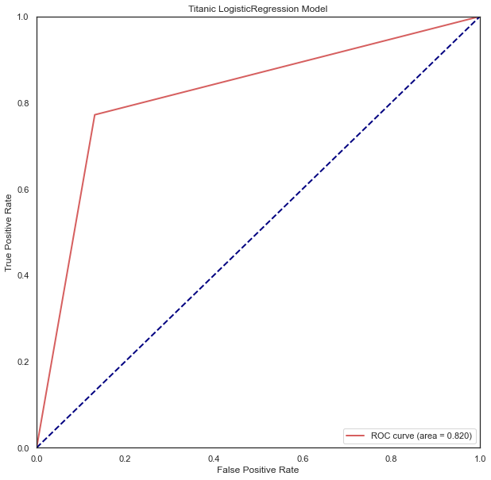


```python
from sklearn.metrics import confusion_matrix
print('GradientBoostingClassifier模型混淆矩阵为\n',confusion_matrix(experData_y.astype(int).astype(str),modelgsGBCtestpre_y.astype(str)))
print('LinearRegression模型混淆矩阵为\n',confusion_matrix(experData_y.astype(int).astype(str),testpre_y.astype(str)))
```

    GradientBoostingClassifier模型混淆矩阵为
     [[503  46]
     [ 76 266]]
    LinearRegression模型混淆矩阵为
     [[477  72]
     [ 78 264]]
    


```python
#TitanicGBSmodle
GBCpreData_y=modelgsGBC.predict(preData_X)
GBCpreData_y=GBCpreData_y.astype(int)
#导出预测结果
GBCpreResultDf=pd.DataFrame()
GBCpreResultDf['PassengerId']=full['PassengerId'][full['Survived'].isnull()]
GBCpreResultDf['Survived']=GBCpreData_y
GBCpreResultDf
#将预测结果导出为csv文件
GBCpreResultDf.to_csv('TitanicGBSmodle.csv',index=False)
```
