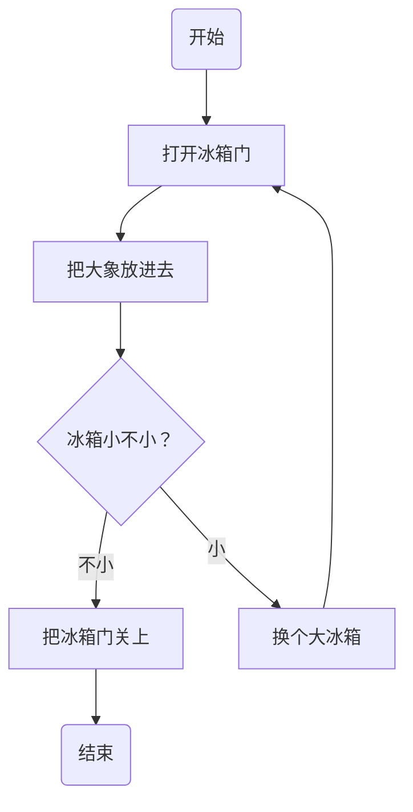

# My map

## Search sites

- [Google](https://www.google.com/)
- [Baidu](https://www.baidu.com/)
- [Bing](https://www.bing.com/)
- [pixabay](https://pixabay.com/)

## WeChat public number

### The preparatory work

- The theme
- conceived
- writing
- typography
- Adjustment and supplement
- Design cover drawing
- Regularly send

### Late work

- Public number text reading
- The reader forward
- The secondary transfer
- Circle of friends
- community
- ......

---

- learning
- The input
- The output



>新的版本不会涉及md的最基础语法.(需要自查). 只会写一些typora 或者 hexo 中使用markdown的有价值的心得. (鲜有人提及的). 关于LaTex 和 word对比可能后续加入. (关于如何让你的blog支持mermaid, 可以参考我写的这篇0x03章节)

# 小众语法
A. 数学公式^[上角标]^
```mermaid
测试一下数学公式支持x^{y^z}=(1+{\rm e}^x)^{-2xy^w}  前后加上$显示为
$ x^{y^z}=(1+{\rm e}^x)^{-2xy^w} $   //现在里面为什么不支持呢
//下方为正常支持
```

B.TODO List语法

这个比较特别, 是在列表语法基础上进行的添加而来. `- [] `即可触发, 但是这有个问题, typora中输入`- `后空格直接就解析为列表了, 只能再源码编辑模式下才能这样 (所以我下面先不加`-`了)

[ ] 支持word,pdf 导出
[ ] 新增 Todo 列表功能
[x] 修复 LaTex 公式渲染问题
# 图表绘制
**A. 绘制流程图**
流程图(`flow`)是可能最常用的表达关系图之一. 因为最简单直观. `code block`备注`flow`即可有提示 (基于`flowchat.js`的流程图已过时, 内容已删)

现在只考虑使用mermaid 作为流程图语法, 并注意更新版本为最新, 避免有些语法不支持, 详细参考官方文档: (以后推荐使用mermaid统一画图)

- 开头声明`graph XX` 即代表开始流程图 (为了区分其他图形)
	`TD` 代表自顶向下 ,纵向图(最常用)
	`LR` 代表自左向右, 横向图
- 规则灵活,语法易读易懂. 最常用的`A --msg--> B --> C` (多层迭代需要高版本mermaid才支持)
- `subgraph xxx end` 格式声明黄色框的子图表示, 也很好用.
- 需要注意的是, 尽量不要一个流程图过长, 展示的时候并不方便, 也不易于理解, 内容多尽量精简或者拆分
**B.时序图**
> 同样,也有两种写法. 一种是标准的code block 选择sequence (已弃用) .另一个是mermaid . 更新后只讲后者用法.

- 核心框基于A ->> B: msg 的语法 , 如果需要虚线就是 A -->> B:msg ,还是很好上手的
- 备注语法Note right/left of A: msg , 也挺简单. (<br/> 可以换行)
- 备注如果在中间, 可用note over A:msg, 如果需要在多个中间note over A,B.
- 单独的节点用participant A ,别名as, 比如你要写中文标注的时候, 就建议用个别名
`mermaid` 的语法基于传统的时序语法, 进行了改良和功能完善(支持的功能非常强大), 详细API可参考官方文档,写的很好. 支持:

- 启动停止标记 activate A , 或者合并为A->>+B : msg ,通过+/ 符号来启动
- 支持循环标识. loop msg + end . 效果挺不错
**C  甘特图**
**D  状态图**
**E   饼图**